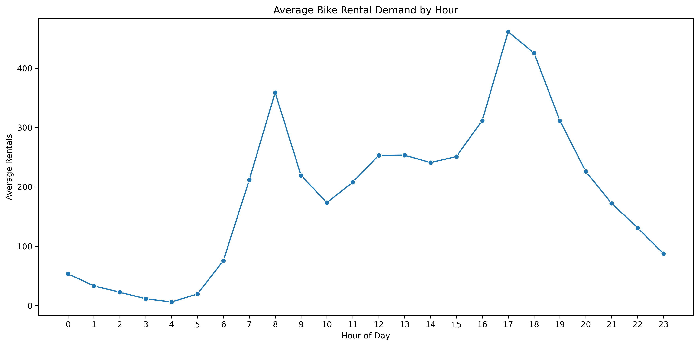
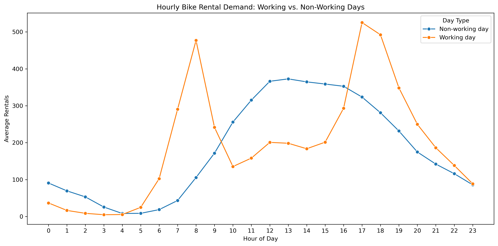
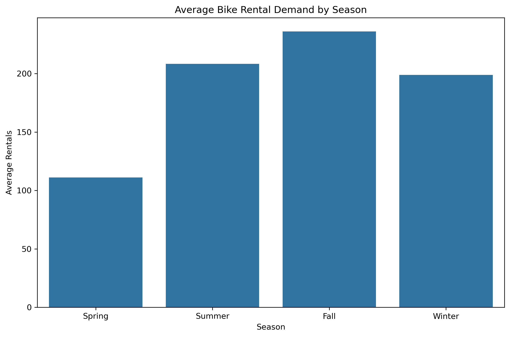
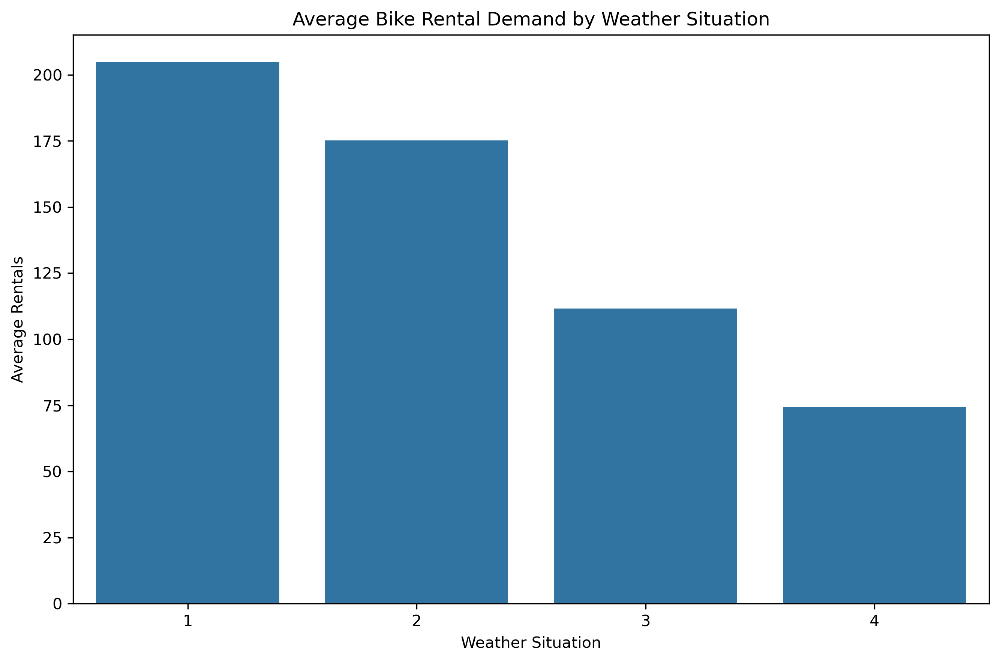
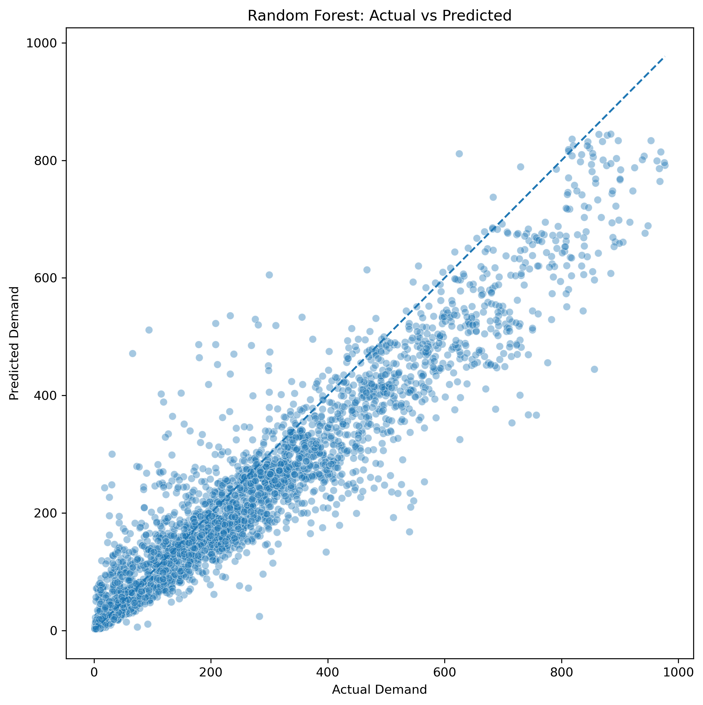
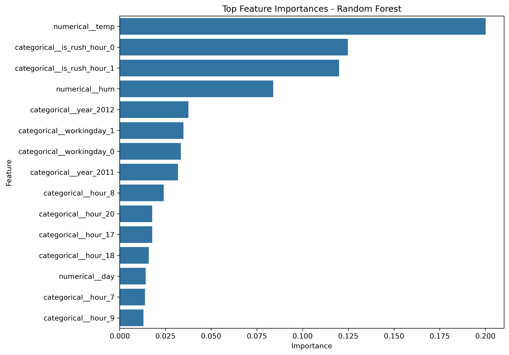

# 🚲 Bike Sharing Demand Analysis & Prediction

> A data analysis and machine learning project for understanding the factors that influence hourly bike-sharing demand and predicting rental demand using temporal, seasonal, and weather-related features.

---

## 📌 Project Overview

This project analyzes hourly bike-sharing demand using the **UCI Bike Sharing Dataset** and builds machine learning models to predict the total number of bike rentals (`cnt`).

The main question of the project is:

> **What factors influence hourly bike-sharing demand, and how accurately can we predict rental demand from temporal, seasonal, and weather-related features?**

The project combines:

- 📊 Exploratory Data Analysis
- 🧮 Statistical analysis
- 🛠️ Feature Engineering
- 🤖 Machine Learning
- 📈 Model Evaluation
- 🔎 Error Analysis
- 💼 Business Interpretation

The analysis focuses on four main perspectives:

1. 🕒 **Temporal patterns** — How demand changes by hour, weekday, month, and year.
2. 🌦️ **Weather effects** — How temperature, humidity, windspeed, and weather conditions relate to demand.
3. 👥 **User behavior** — How casual and registered users behave differently throughout the day.
4. 🤖 **Demand prediction** — How accurately machine learning models can predict total hourly rentals.

---

## 🖼️ Project Preview

### ⏰ Hourly Demand



### 🏢 Working vs Non-Working Days



### 🍂 Seasonal Demand



### 🌦️ Weather and Demand



### 🎯 Actual vs Predicted Demand



### ⭐ Feature Importance



---

# 🎯 Project Objectives

The project was designed around the following objectives:

### 1. 📊 Understand the Dataset

- Inspect the structure and data types.
- Identify missing values and duplicate records.
- Understand the target variable.
- Validate relationships between important columns.
- Identify columns that should not be used as predictors.

### 2. 🔍 Explore Demand Patterns

Analyze demand according to:

- Hour of the day
- Weekday
- Month
- Year
- Working day
- Season
- Weather situation
- Temperature
- Humidity

### 3. 🛠️ Engineer Useful Features

Create additional temporal features from the original date and hour information.

### 4. 🤖 Build Predictive Models

Compare several regression models:

- Mean Baseline
- Linear Regression
- Decision Tree Regressor
- Random Forest Regressor

### 5. 📈 Evaluate Model Performance

Models are evaluated using:

- MAE
- RMSE
- R²

### 6. 💼 Translate Results into Business Insights

Interpret the findings from the perspective of:

- Demand planning
- Operational capacity
- Bike availability
- Peak-hour management
- Weather and seasonal planning

---

# 📦 Dataset

The project uses the **UCI Bike Sharing Dataset**.

### Dataset Information

| Property | Value |
|---|---|
| Dataset | Bike Sharing Dataset |
| Source | UCI Machine Learning Repository |
| Dataset ID | 275 |
| DOI | 10.24432/C5W894 |
| Original System | Capital Bikeshare |
| Location | Washington, D.C., USA |
| Period | 2011–2012 |
| Granularity | Hourly |
| File Used | `hour.csv` |
| Rows | 17,379 |
| Columns | 17 |

The dataset contains hourly bike rental information together with temporal, seasonal, and weather-related variables.

---

# 🧾 Dataset Features

The original dataset contains the following 17 columns:

| Feature | Description |
|---|---|
| `instant` | Record identifier |
| `dteday` | Date |
| `season` | Season category |
| `yr` | Year indicator |
| `mnth` | Month |
| `hr` | Hour of the day |
| `holiday` | Holiday indicator |
| `weekday` | Day of the week |
| `workingday` | Working-day indicator |
| `weathersit` | Weather situation |
| `temp` | Normalized temperature |
| `atemp` | Normalized feeling temperature |
| `hum` | Normalized humidity |
| `windspeed` | Normalized windspeed |
| `casual` | Number of casual-user rentals |
| `registered` | Number of registered-user rentals |
| `cnt` | Total number of rentals |

The target variable is:

```text
cnt
```

where:

```text
cnt = casual + registered
```

This relationship was explicitly validated during data understanding.

---

# 🔐 Data Validation

Before analysis and modeling, the dataset was checked for:

- Missing values
- Duplicate rows
- Expected columns
- Target consistency
- Date formatting
- Identifier uniqueness

### Validation Results

- ✅ 17,379 rows
- ✅ 17 columns
- ✅ No missing values
- ✅ No duplicate rows
- ✅ `instant` is unique
- ✅ `cnt = casual + registered`
- ✅ Date range: January 1, 2011 → December 31, 2012

---

# ⚠️ Target Leakage Prevention

One of the important modeling decisions in this project is preventing **target leakage**.

The target is:

```text
cnt
```

However:

```text
cnt = casual + registered
```

Therefore, using `casual` or `registered` as predictors would directly expose information about the target to the model.

For this reason:

```text
casual
registered
```

are excluded from the predictive feature matrix.

The column:

```text
instant
```

is also excluded because it is a record identifier rather than a meaningful predictive feature.

The final model therefore predicts demand without directly using either component of the target.

---

# 🔄 Data Pipeline

The complete project pipeline is:

```text
Raw Dataset
     │
     ▼
Data Loading
     │
     ▼
Data Validation
     │
     ├── Missing Values
     ├── Duplicate Rows
     ├── Expected Columns
     └── Target Validation
     │
     ▼
Datetime Conversion
     │
     ▼
Exploratory Data Analysis
     │
     ▼
Feature Engineering
     │
     ▼
Chronological Train/Test Split
     │
     ▼
Preprocessing Pipeline
     │
     ├── One-Hot Encoding
     └── Standard Scaling
     │
     ▼
Regression Models
     │
     ├── Baseline
     ├── Linear Regression
     ├── Decision Tree
     └── Random Forest
     │
     ▼
Model Evaluation
     │
     ├── MAE
     ├── RMSE
     └── R²
     │
     ▼
Error Analysis
     │
     ▼
Feature Importance
     │
     ▼
Business Interpretation
```

---

# 📊 Exploratory Data Analysis

The exploratory analysis investigates how bike demand changes across different temporal and environmental dimensions.

---

## ⏰ Demand by Hour

Hourly demand shows a strong temporal pattern.

The two most prominent peaks occur around:

- **08:00 → 359.01 average rentals**
- **17:00 → 461.45 average rentals**

The highest average demand occurs around **17:00**.

Demand is very low during the early morning hours, with the lowest average around:

- **04:00 → 6.35 rentals**

This demonstrates that the hour of the day is one of the most important dimensions of bike-sharing demand.

---

## 🏢 Working Days vs Non-Working Days

The hourly pattern differs substantially between working and non-working days.

### Working Days

Working days show clear:

- Morning peak
- Evening peak

This pattern is consistent with commuting-related demand.

### Non-Working Days

Non-working days show:

- Lower early-morning demand
- A later increase in demand
- A broader daytime/afternoon demand pattern

Therefore, the same hourly planning strategy should not necessarily be applied equally to working and non-working days.

---

# 📅 Demand by Month

Average demand changes significantly throughout the year.

| Month | Average Demand |
|---:|---:|
| January | 94.42 |
| February | 112.87 |
| March | 155.41 |
| April | 187.26 |
| May | 222.91 |
| June | 240.52 |
| July | 231.82 |
| August | 238.10 |
| September | 240.77 |
| October | 222.16 |
| November | 177.34 |
| December | 142.30 |

Demand generally:

```text
increases from winter → spring → summer
```

and then:

```text
decreases toward the end of the year
```

June and September have the highest monthly average demand in the analyzed data.

---

# 📆 Demand by Year

The average demand in **2012 is visibly higher than in 2011**.

This indicates that the system experienced substantially different demand levels between the two years.

The year therefore becomes an important predictive feature.

However, because the dataset covers only 2011 and 2012, the observed year-to-year difference should not automatically be interpreted as a long-term growth trend.

---

# 🍂 Demand by Season

Average demand by season:

| Season | Average Demand |
|---|---:|
| Spring | 111.11 |
| Summer | 208.34 |
| Fall | 236.02 |
| Winter | 198.87 |

The highest average demand occurs in **Fall**, while **Spring** has the lowest average demand.

This demonstrates that seasonal conditions have a substantial relationship with bike-sharing demand.

---

# 🌦️ Demand by Weather Situation

Average demand by weather category:

| Weather Situation | Average Demand |
|---|---:|
| 1 | 204.87 |
| 2 | 175.17 |
| 3 | 111.58 |
| 4 | 74.33 |

Demand decreases as weather conditions become less favorable.

The strongest average demand is observed under weather category `1`, while category `4` has the lowest average demand.

---

# 🌡️ Temperature vs Demand

Temperature shows a generally positive relationship with bike-sharing demand.

As temperature increases, demand generally tends to increase as well.

However, the scatter plot also shows considerable variation, meaning temperature alone cannot explain hourly demand.

This supports the need for a multivariate predictive model.

---

# 💧 Humidity vs Demand

Humidity shows a generally negative relationship with demand.

Higher humidity is associated with lower demand in many observations, although the relationship contains substantial variation.

This indicates that humidity can contribute useful predictive information when combined with temporal and other weather variables.

---

# 👥 Casual vs Registered Users

The project also analyzes the behavior of:

- Casual users
- Registered users

Registered users represent a substantially larger share of demand and show sharper commute-related patterns.

Casual users show a broader daytime/afternoon pattern.

This distinction is useful for understanding user behavior, although `casual` and `registered` are intentionally excluded from the prediction model because they directly compose the target variable.

---

# 🔗 Correlation Analysis

A correlation heatmap was used to investigate relationships among numerical and encoded variables.

The analysis indicates meaningful associations between total demand and variables such as:

- Hour
- Temperature
- Year
- Humidity
- Weather situation

Correlation is used here as an exploratory tool and should not be interpreted as evidence of causation.

---

# 🛠️ Feature Engineering

The original dataset already contains useful temporal variables, but additional features were created to make the temporal structure explicit.

The final feature matrix contains **14 features**.

---

## 📌 Base Features

The following variables are retained from the original dataset:

```text
season
holiday
workingday
weathersit
temp
hum
windspeed
```

---

## ⚙️ Engineered Features

The following features are created from the date and hour information:

```text
year
month
day
hour
weekday
is_weekend
is_rush_hour
```

### `year`

Extracted from `dteday`.

### `month`

Extracted from `dteday`.

### `day`

Day of the month extracted from `dteday`.

### `hour`

Derived from the original `hr` feature.

### `weekday`

Represents the day of the week.

### `is_weekend`

Defined as:

```text
Saturday or Sunday → 1
Weekday → 0
```

### `is_rush_hour`

Rush hour is defined as:

```text
07:00
08:00
09:00
16:00
17:00
18:00
19:00
```

These observations receive:

```text
is_rush_hour = 1
```

All other hours receive:

```text
is_rush_hour = 0
```

---

# 🎯 Final Feature Set

The final model uses:

```text
season
holiday
workingday
weathersit
temp
hum
windspeed
year
month
day
hour
weekday
is_weekend
is_rush_hour
```

The target is:

```text
cnt
```

The following variables are not used as model predictors:

```text
instant
dteday
yr
mnth
hr
atemp
casual
registered
cnt
```

`dteday` is transformed into temporal features, while the original encoded temporal variables are represented through the engineered feature set.

---

# 🤖 Predictive Modeling

The project compares a simple baseline with three regression models.

---

## 1. 📏 Mean Baseline

The baseline predicts the mean demand of the training set for every test observation.

This provides a reference point for evaluating whether machine learning models provide meaningful predictive improvement.

---

## 2. 📐 Linear Regression

Linear Regression is used as a simple interpretable model.

Because Linear Regression is sensitive to feature scale:

- Numerical features are standardized.
- Categorical features are one-hot encoded.

The preprocessing and model are combined into a single `Pipeline`.

---

## 3. 🌳 Decision Tree Regressor

A Decision Tree Regressor is used to capture nonlinear relationships between demand and the input features.

The tree model does not require feature scaling.

Categorical variables are still one-hot encoded through the preprocessing pipeline.

---

## 4. 🌲 Random Forest Regressor

Random Forest combines multiple decision trees to model more complex nonlinear relationships.

Configuration:

```text
n_estimators = 200
random_state = 42
n_jobs = -1
```

Random Forest is the final best-performing model among the tested approaches.

---

# ⏱️ Train/Test Strategy

Because this dataset is chronological, a random train/test split would allow future observations to appear in the training data.

Instead, the project uses a **time-based chronological split**.

### Training Set

```text
2011-01-01 → 2012-08-07
```

### Test Set

```text
2012-08-07 → 2012-12-31
```

Approximately:

```text
80% → Training
20% → Testing
```

This provides a more realistic evaluation setting for demand prediction.

---

# ⚙️ Preprocessing Pipeline

Scikit-learn `Pipeline` and `ColumnTransformer` are used to keep preprocessing and modeling together.

### Categorical Features

Categorical features are transformed using:

```text
OneHotEncoder(handle_unknown="ignore")
```

### Numerical Features

For Linear Regression:

```text
StandardScaler
```

is applied to numerical features.

For tree-based models, numerical features are passed through without scaling.

This approach keeps preprocessing reproducible and prevents manual preprocessing inconsistencies between training and testing data.

---

# 📈 Model Results

The models were evaluated using:

- Mean Absolute Error (MAE)
- Root Mean Squared Error (RMSE)
- R² Score

### Results

| Model | MAE | RMSE | R² |
|---|---:|---:|---:|
| 🌲 Random Forest | **54.90** | **81.10** | **0.865** |
| 🌳 Decision Tree | 67.54 | 105.01 | 0.773 |
| 📐 Linear Regression | 98.79 | 133.96 | 0.631 |
| 📏 Mean Baseline | 174.98 | 232.61 | -0.113 |

---

# 🏆 Best Model

The best-performing model is:

## 🌲 Random Forest Regressor

Performance:

```text
MAE  = 54.90
RMSE = 81.10
R²   = 0.865
```

The Random Forest substantially outperforms:

- Mean Baseline
- Linear Regression
- Decision Tree

The R² score of approximately **0.865** indicates that the model explains a large proportion of the variation in the test-set demand under this evaluation setup.

The lower RMSE compared with the other tested models also indicates stronger predictive performance on the selected test period.

---

# 🔎 Error Analysis

Model evaluation does not stop at aggregate metrics.

The project also investigates the prediction errors of the Random Forest model.

Residuals are calculated as:

```text
Residual = Actual - Predicted
```

### Residual Summary

```text
Mean     = 33.72
Std      = 73.77
Minimum  = -417.64
Maximum  = 411.04
```

The positive mean residual indicates that the model tends to **underpredict demand overall** on the test set.

The error analysis also identifies observations with large absolute prediction errors.

Some of the largest errors are greater than **400 rentals**.

These large errors occur in individual observations where the actual demand differs substantially from the model prediction.

Therefore, although the model performs well overall, prediction errors can still become significant for certain demand observations.

---

# 🎯 Actual vs Predicted

The actual-vs-predicted analysis shows that Random Forest predictions generally follow the observed demand pattern.

However:

- Some observations are substantially overpredicted.
- Some observations are substantially underpredicted.
- Large errors remain in a number of observations.
- Higher-demand observations can contain particularly large absolute errors.

This indicates that the model is useful for demand estimation but should not be treated as perfectly accurate.

---

# ⭐ Feature Importance

Random Forest feature importance was used to identify which encoded features contributed most to the model's predictions.

The most important individual features include:

1. 🌡️ `temp`
2. 🚦 `is_rush_hour`
3. 💧 `hum`
4. 📅 `year`
5. 🏢 `workingday`
6. ⏰ Individual `hour` categories
7. 📆 `day`

The normalized temperature feature has the highest individual importance in the trained Random Forest model.

Rush-hour indicators also receive substantial importance, highlighting the role of temporal demand patterns.

---

## ⚠️ Feature Importance Is Not Causality

Feature importance should not be interpreted as:

> "This feature causes demand to increase."

It only describes how useful the feature was for making predictions within the trained Random Forest.

Because categorical variables are one-hot encoded, their total importance is distributed across multiple encoded categories.

Therefore, feature importance is used as a model interpretation tool rather than a causal analysis.

---

# 💼 Business Interpretation

The analysis can be translated into several practical business insights.

---

## 🚲 1. Peak-Hour Capacity Planning

Demand is highly dependent on the hour of the day.

The strongest peaks occur around:

```text
08:00
17:00–18:00
```

This suggests that bike availability and operational capacity should be planned around peak commuting periods.

---

## 🏢 2. Working-Day Demand Is Different

Working days show clear morning and evening peaks.

Non-working days show a different and more distributed daytime pattern.

Operational planning should therefore distinguish between:

```text
Working Days
```

and:

```text
Non-Working Days
```

rather than treating all days identically.

---

## 🌦️ 3. Weather-Aware Planning

Weather conditions have a meaningful relationship with demand.

Poorer weather conditions are associated with lower average rental demand.

This information can support:

- Bike availability planning
- Operational staffing
- Capacity management
- Short-term demand estimation

---

## 🍂 4. Seasonal Planning

Demand changes significantly throughout the year.

Demand is considerably higher during parts of the warmer seasons and lower during winter months.

This suggests that capacity and operational planning should account for seasonal demand variation.

---

## 📈 5. Historical Demand Growth

Demand is visibly higher in 2012 than in 2011.

The year feature also appears among the important features in the Random Forest model.

However, only two years are available, so this result should be interpreted as an observed historical difference rather than a reliable long-term growth forecast.

---

## 🤖 6. Machine Learning Can Improve Demand Estimation

The Random Forest model significantly outperforms the baseline and the simpler regression models.

This suggests that the relationship between bike demand and the available temporal/weather variables is not adequately represented by a simple linear relationship alone.

The nonlinear model provides a substantially stronger predictive result on the chronological test period.

---

# 🏗️ Project Architecture

The project separates data processing, feature engineering, visualization, and modeling logic.

```text
bike-sharing-demand-analysis/
│
├── data/
│   ├── raw/
│   │   └── hour.csv
│   │
│   └── processed/
│
├── notebooks/
│   ├── 01_data_understanding.ipynb
│   ├── 02_exploratory_analysis.ipynb
│   ├── 03_feature_engineering.ipynb
│   └── 04_demand_prediction.ipynb
│
├── src/
│   ├── __init__.py
│   ├── data_processing.py
│   ├── feature_engineering.py
│   ├── visualization.py
│   └── modeling.py
│
├── reports/
│   └── figures/
│
├── README.md
├── requirements.txt
├── .gitignore
└── LICENSE
```

---

# 📓 Notebook Structure

The notebooks follow a sequential analytical workflow.

### `01_data_understanding.ipynb`

Responsible for:

- Loading the raw dataset
- Inspecting dimensions
- Inspecting data types
- Checking missing values
- Checking duplicates
- Descriptive statistics
- Target analysis
- Target consistency validation
- Initial data conclusions

---

### `02_exploratory_analysis.ipynb`

Responsible for:

- Target distribution
- Hourly demand
- Weekday demand
- Monthly demand
- Yearly demand
- Working-day analysis
- Seasonal analysis
- Weather analysis
- Temperature analysis
- Humidity analysis
- Casual vs registered users
- Correlation analysis
- Summary tables
- Exporting selected figures

---

### `03_feature_engineering.ipynb`

Responsible for:

- Creating temporal features
- Creating weekend indicators
- Creating rush-hour indicators
- Building the final feature matrix
- Separating features and target
- Validating the resulting feature structure

---

### `04_demand_prediction.ipynb`

Responsible for:

- Chronological train/test split
- Baseline evaluation
- Model training
- Model comparison
- Prediction generation
- Actual vs predicted analysis
- Residual analysis
- Error analysis
- Feature importance
- Exporting final model figures

---

# 🧩 Source Code Architecture

The reusable logic is separated into four Python modules.

---

## `src/data_processing.py`

Handles:

- Dataset loading
- File validation
- Column validation
- Missing-value validation
- Duplicate validation
- Target consistency validation
- Date conversion

Main functions:

```text
load_data()
validate_data()
prepare_data()
load_and_prepare_data()
```

---

## `src/feature_engineering.py`

Handles:

- Temporal feature creation
- Weekend classification
- Rush-hour classification
- Feature/target separation

Main functions:

```text
add_time_features()
create_features()
```

---

## `src/modeling.py`

Handles:

- Train/test splitting
- Preprocessing pipelines
- Model construction
- Model training
- Metric calculation
- Baseline evaluation
- Model evaluation
- Prediction generation
- Feature importance

Main models:

```text
LinearRegression
DecisionTreeRegressor
RandomForestRegressor
```

---

## `src/visualization.py`

Contains reusable plotting functions for:

- Demand distributions
- Hourly demand
- Weekday demand
- Monthly demand
- Yearly demand
- Working-day demand
- Seasonal demand
- Weather demand
- Temperature vs demand
- Humidity vs demand
- User-type demand
- Correlation heatmap
- Actual vs predicted
- Feature importance

Figures can optionally be saved directly to:

```text
reports/figures/
```

---

# 🧪 Testing & Validation

This project does not currently include a dedicated `pytest` test suite.

Instead, validation is implemented directly within the data-processing layer.

The validation logic checks:

```text
✓ Expected columns
✓ Missing values
✓ Duplicate rows
✓ cnt = casual + registered
✓ Date conversion
```

The notebooks also perform additional validation and inspection throughout the workflow.

The machine learning pipeline was executed successfully and produced the reported evaluation results.

---

# ⚙️ Installation

## 1. Clone the Repository

Clone the repository from GitHub and navigate into the project directory.

```bash
cd bike-sharing-demand-analysis
```

---

## 2. Create a Virtual Environment

### Windows

```powershell
python -m venv .venv
```

Activate it:

```powershell
.\.venv\Scripts\Activate.ps1
```

### Linux / macOS

```bash
python3 -m venv .venv
source .venv/bin/activate
```

---

## 3. Install Dependencies

```bash
pip install -r requirements.txt
```

---

# ▶️ Running the Project

Start Jupyter:

```bash
jupyter notebook
```

Then open the notebooks in the following order:

```text
01_data_understanding.ipynb
        ↓
02_exploratory_analysis.ipynb
        ↓
03_feature_engineering.ipynb
        ↓
04_demand_prediction.ipynb
```

The notebooks use relative paths such as:

```text
../data/raw/hour.csv
```

Therefore, they should be opened/executed with the notebook working directory aligned with the `notebooks/` directory.

---

# 📚 Technologies

The project is built using:

| Technology | Purpose |
|---|---|
| 🐍 Python | Core programming language |
| 🐼 Pandas | Data manipulation and analysis |
| 🔢 NumPy | Numerical computation |
| 📊 Matplotlib | Data visualization |
| 🎨 Seaborn | Statistical visualization |
| 🤖 Scikit-learn | Machine learning |
| 📓 Jupyter | Interactive analysis |

---

# 🧠 Machine Learning Concepts Demonstrated

This project demonstrates practical understanding of:

- Regression
- Train/Test splitting
- Time-based validation
- Feature engineering
- Categorical encoding
- Feature scaling
- Pipelines
- ColumnTransformer
- Model comparison
- MAE
- RMSE
- R²
- Residual analysis
- Feature importance
- Target leakage prevention

---

# 🔬 Engineering Highlights

### 🛡️ 1. Target Leakage Prevention

`casual` and `registered` are excluded because they directly compose the target `cnt`.

---

### ⏱️ 2. Chronological Evaluation

A chronological train/test split is used instead of random splitting to preserve the temporal structure of the dataset.

---

### 🧩 3. Reusable ML Pipelines

Preprocessing and models are encapsulated in Scikit-learn `Pipeline` objects.

This ensures that preprocessing applied during training is consistently applied during prediction.

---

### 🗂️ 4. Modular Source Code

Data processing, feature engineering, visualization, and modeling are separated into dedicated modules.

---

### 🔁 5. Reproducibility

Random Forest and Decision Tree models use:

```text
random_state = 42
```

Random Forest also uses:

```text
n_jobs = -1
```

for parallel tree construction.

---

### 📈 6. Business-Oriented Analysis

The project does not stop at model accuracy.

The analysis connects demand patterns to:

- Peak-hour operations
- Working-day behavior
- Seasonal planning
- Weather conditions
- Bike availability
- Operational capacity

---

# ⚠️ Limitations

The current project intentionally keeps its scope focused.

### 1. 📅 Limited Historical Period

The dataset contains only:

```text
2011–2012
```

Therefore, conclusions about long-term demand trends are limited.

---

### 2. ⏳ No Lag or Rolling Features

The current project does not use:

- Lag variables
- Rolling averages
- Previous-hour demand
- Previous-day demand

The task is treated as regression rather than full time-series forecasting.

---

### 3. 🌎 No External Variables

The model does not incorporate additional external information such as:

- Events
- Economic indicators
- Detailed calendar effects
- External transportation information

---

### 4. 🔧 No Hyperparameter Optimization

The models use fixed configurations rather than extensive hyperparameter search.

This keeps the project focused on:

```text
Data Analysis
+
Feature Engineering
+
Model Comparison
+
Interpretation
```

---

### 5. 📊 Single Chronological Holdout

The evaluation uses one chronological train/test split.

A production-level forecasting system would benefit from more robust temporal validation strategies.

---

### 6. ⭐ Feature Importance Is Not Causal

Random Forest feature importance indicates predictive usefulness within the model, not causal influence.

---

# 🚀 Future Roadmap

Possible future improvements include:

- [ ] Add lag and rolling-demand features
- [ ] Implement walk-forward validation
- [ ] Perform systematic hyperparameter tuning
- [ ] Test gradient boosting models
- [ ] Incorporate additional calendar and event information
- [ ] Investigate more advanced time-series approaches
- [ ] Build an interactive demand-analysis dashboard
- [ ] Deploy the final prediction model as an API

These items are **future extensions** and are not part of the current implementation.

---

# 📁 Generated Reports

Selected figures generated by the project are stored in:

```text
reports/figures/
```

Current exported figures include:

```text
hourly_demand.png
workingday_hourly_demand.png
seasonal_demand.png
weather_demand.png
actual_vs_predicted.png
feature_importance.png
```

---

# 📌 Key Findings

Based on the completed analysis:

### ⏰ Temporal

Demand is strongly dependent on the hour of the day, with major peaks around **08:00** and especially **17:00**.

### 🏢 Working Day

Working days exhibit pronounced morning and evening demand peaks, while non-working days show a later and broader daytime pattern.

### 📅 Monthly

Demand generally increases from the beginning of the year toward the warmer months and decreases toward the end of the year.

### 🍂 Seasonal

Fall has the highest average demand, while Spring has the lowest average demand.

### 🌦️ Weather

Demand decreases under less favorable weather conditions.

### 🌡️ Temperature

Temperature has a generally positive association with rental demand.

### 💧 Humidity

Higher humidity is generally associated with lower demand, although considerable variation remains.

### 🤖 Prediction

Random Forest provides the strongest predictive performance among the tested models:

```text
MAE  = 54.90
RMSE = 81.10
R²   = 0.865
```

### ⭐ Important Features

Temperature, rush-hour indicators, humidity, year, working-day indicators, and hour categories are among the most important individual model features.

---

# 🎯 Final Conclusion

This project demonstrates a complete data-analysis-to-machine-learning workflow on a real-world bike-sharing dataset.

The analysis shows that hourly bike demand is influenced by a combination of:

```text
Temporal Patterns
+
Working-Day Behavior
+
Seasonality
+
Weather Conditions
```

A Random Forest Regressor provides substantially better predictive performance than the baseline, Linear Regression, and Decision Tree models on the chronological test period.

The resulting analysis can be used as a foundation for operational demand planning, particularly around peak hours, seasonal changes, and weather conditions.

At the same time, the remaining prediction errors demonstrate that the model is not perfect and that additional temporal and external information could improve future versions.

---

# 📜 License

This project is released under the **MIT License**.

The dataset is provided separately under the licensing terms specified by the **UCI Machine Learning Repository** and should be treated independently from the project's source code.

See:

```text
LICENSE
```

for the software license.

---

# 👨‍💻 Author

**Arad Shafiee**

GitHub:

```text
AradCharon
```

---

# ⭐ Repository

```text
AradCharon/bike-sharing-demand-analysis
```

---

> 🚲 **Bike Sharing Demand Analysis & Prediction**
>
> Data Analysis • Statistics • Feature Engineering • Machine Learning • Business Insight